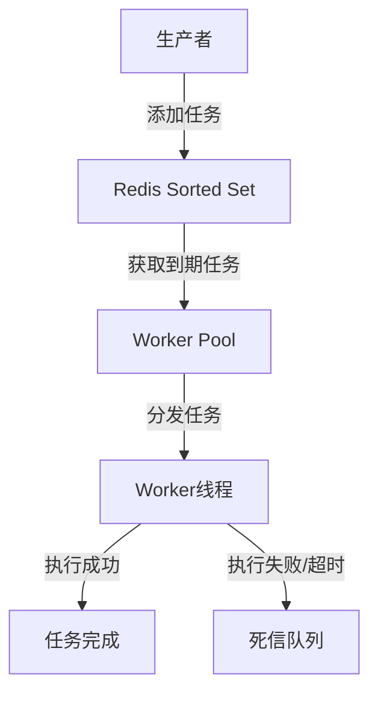

# 延时队列设计文档

## 1. 系统架构

延时队列系统基于Redis的Sorted Set实现，通过Worker Pool进行任务处理，具有以下特点：

- 使用Redis Sorted Set存储任务，支持按时间戳排序和原子操作
- 采用Worker Pool模式，控制任务并发处理
- 支持任务超时处理和错误重试机制
- 实现死信队列，处理失败任务

## 2. 核心组件

### 2.1 DelayTask（延时任务）

```go
type DelayTask struct {
    ID       string      // 任务唯一标识
    Topic    string      // 任务主题
    Data     interface{} // 任务数据
    ExecTime int64       // 执行时间戳
}
```

### 2.2 Worker Pool（工作池）

- 功能：管理工作协程，控制任务并发执行
- 配置：
  - workerNum：工作协程数量
  - timeout：任务执行超时时间
  - deadLetterKey：死信队列键名

### 2.3 死信队列

- 用途：存储执行失败或超时的任务
- 实现：使用Redis Sorted Set存储
- 处理时机：
  - 任务执行返回错误
  - 任务执行超时

## 3. 工作流程



## 4. 关键实现

### 4.1 任务添加

```go
func AddDelayTask(task *DelayTask) error {
    taskJSON, _ := json.Marshal(task)
    return rdb.ZAdd(context.TODO(), "delay_queue", &redis.Z{
        Score:  float64(task.ExecTime),
        Member: string(taskJSON),
    }).Err()
}
```

### 4.2 任务消费

使用Lua脚本保证原子性操作：
```lua
local current_time = tonumber(ARGV[1])
local tasks = redis.call('ZRANGEBYSCORE', KEYS[1], '-inf', current_time)
if #tasks > 0 then
    redis.call('ZREM', KEYS[1], unpack(tasks))
end
return tasks
```

## 5. 性能优化

### 5.1 并发控制
- 通过Worker Pool限制最大并发数
- 支持动态调整工作协程数量
- 任务分配均衡

### 5.2 错误处理
- 任务执行失败自动进入死信队列
- 支持任务重试机制
- 超时控制避免任务阻塞

### 5.3 监控指标
- 任务处理数量
- 最大并发任务数
- 任务执行时间
- 失败任务统计

## 6. 使用示例

```go
// 创建工作池
pool := NewWorkerPool(rdb, 3, time.Second, "dead_letter")

// 启动工作池
pool.Start(func(task *DelayTask) error {
    // 处理任务的业务逻辑
    return nil
})

// 添加延时任务
task := &DelayTask{
    ID:    "order_123",
    Topic: "order_timeout",
    Data:  "order data",
}
pool.AddTask(task)
```